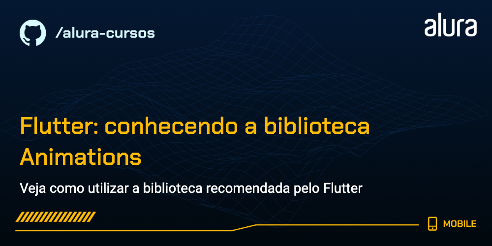

# Flutter: Conhecendo a biblioteca Animations

Projeto Hyrule para o curso Flutter: Conhecendo a biblioteca Animations, focado em compreender e implementar uma biblioteca de animações em seu projeto.

### Tópicos abordados no curso:

- O que são animações;
- Importância das animações;
- Como implementar as seguinte animações:
    - OpenContainer;
    - SharedAxis;
    - PageTransitionSwitcher;
    - Hero widget;
- Conhecimentos de Material Design.

Este curso é indicado para pessoas que já tem conhecimento básico e querem aprofundar seu conhecimento em Flutter, seguindo boas práticas e também entendendendo como implementar a biblioteca Animations dentro de seu projeto.

## 📑 Requisitos

- Conhecimentos básicos de Flutter e Dart;
- VS Code com plugins do Flutter e Dart instalados (recomendado para acompanhar este curso);
- É importante ter o Flutter na versão 3.10.2.

## ✨ Funcionalidades do projeto

- Buscar entradas de uma API de acordo com uma categoria;
- Salvar uma entrada no banco de dados;
- Mostrar entradas;
- Deletar uma entrada;

## 🛠️ Abrir e rodar o projeto

Aqui vem um passo a passo para abrir e rodar o projeto.

- **Open an Existing Project** (ou alguma opção similar)
- Procure o local onde o projeto está e o selecione (Caso o projeto seja baixado via zip, é necessário extraí-lo antes de procurá-lo)
- Por fim clique em OK
- Depois basta rodar o comando `flutter run` na pasta do projeto
